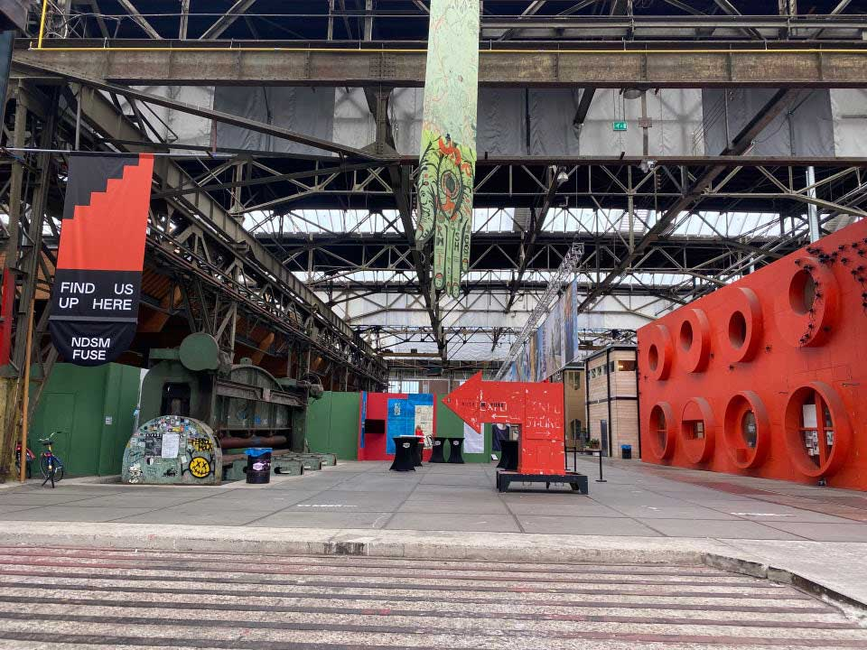
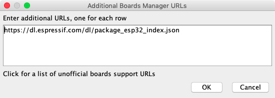
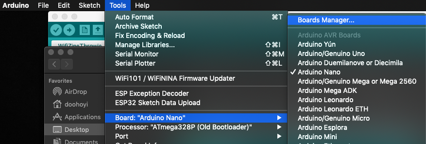
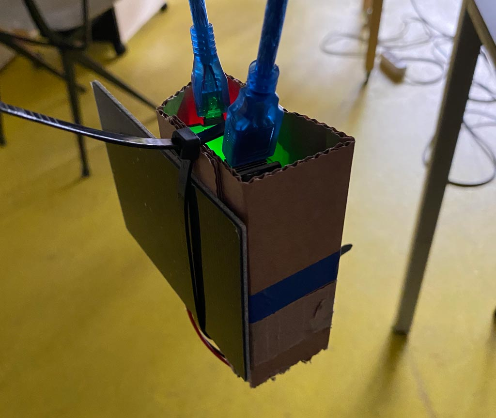

# Solarpunk Kids: Wifi Scavenger Hunt 

This is an adaptation of the workshop and – amazing – documentation prepared by Wonjung Shin and Dooho Yi (Dianaband) for the Walking signal / WIFI hotspot zine workshop hosted at Hackers and Designers in 2019. See original here: [https://github.com/applecargo/WifiZineThrowie](https://github.com/applecargo/WifiZineThrowie) 

Their workshop in turn builds up on the research by Andy Reischle (AreResearch), whose research is linked to at the bottom of this page. 

**WIP! Still needs to be edited/adapted for solarpunk workshop.**

**To Do**: 

 * add own intro and activities (so it becomes workshop script)
 * add sound to html template
 * image captions/alt text

 
## About this project

Intergenerational workshop collaboration

Mz* Baltazar
Prototype PGH
H&D
Funders

Info info info

See also: [www.hackersanddesigners.nl](www.hackersanddesigners.nl)

## Solarpunk? Internet? Kids?

### Introductions

* What is your name?
* What gives you energy and a good feeling?

### Why do technologies need energy? 

* What is energy? Where does it come from?

* Only transforms, never disappears? What does it mean? 

	* running, getting hot
	* drinking tea: the kettle, our body

* Alternative sources of energy do you know?

	* Solar power
	* Dynamo
	* Lemons
	* How much energy can you create with them?

[](https://www.youtube.com/watch?v=AXfvayFPXFU)
<br>*Click on the image to watch on Youtube!*

### Alternatives for batteries?

* How much energy do we need to have Internet?
* How can you find out? 
* LED is easily satisfied but chips (brains) are not
* Can we power devices that make up "the Internet" in a different way?
* Possibilities? Difficulties? 

### The incredible shrinking Internet? 

* What if an average webpage were only 1 MB
* What if some of the Internet wasn't worldwide? 


### We made a small Internet, let's find it!

* Turn off your data plan
* Look for the list of wifi networks on your phone
* Found it? Let's go out and find the network called **"solarpunk-schat"**.
* When you find it, connect to it and follow the instructions to find the first treasure.


## Workshop outline

### After we find the first treasure

Then we split into groups to design our own scavenger hunt extravaganza using small wifi servers and mini websites we will make together. 
 
**Designers - team B** 

Our young participants will be the designers of the scavenger hunt. With Pernilla they will explore the building for clever hiding spots, and ways to give visual clues to find them - but not too many because we like a challenge! When that is taken care of, they will prepare lunch together, so the grown-ups can be fed around 12.30. 
 
**Hackers - team A**

In the meantime, the grown-up participants will take on the hacker roles! Depending on your interests and skillset you experiment with coding your own small website in HTML (and CSS and Javascript if you are up for it), and/or you will learn to program a small microcontroller so can act as a tiny webserver that can be used to publish the tiny websites hyperlocally (range of +/- 20 m). After all that hacking business, we will be hungry for lunch and catching up.
 


### What are we making? 

We will program a small wireless device with an ESP32 chip to serve a tiny (max 2MB) html websites via WiFi. The module is powered by a battery, which in turn is charged by a solar cell. The Wifi module "serves" a small website anytime a smartphone tries to log on to the network it is broadcasting (like an internet hotspot). It allows you to redesign the "log-in" screen that usually pops up when you try to log on to public WiFi networks, and hijack it to publish content you want to share WiFi, but only with your neighbours and local friends within a ~25 m range. 


## 0. Materials and preparations

*Account for one kit per duo. Total cost of the components per kit is around € 16,75 ex shipping.*

- A computer per duo
- A mobile phone per duo (no dataplan needed)
- Internet connection to download libraries and look things up
- A development board with ESP32 module and 4MB flash memory, e.g. [ESP32 - CP2102](https://www.tinytronics.nl/shop/nl/development-boards/microcontroller-boards/met-wi-fi/esp32-wifi-en-bluetooth-board-cp2102)
- A short micro USB cable e.g. [this one](https://www.tinytronics.nl/shop/nl/kabels-en-connectoren/kabels-en-adapters/usb/micro-usb/micro-usb-kabel-30cm)
- A 5V charging board e.g. this [LilyGo TTGO H435 with a 18650 rechargeable battery holder](https://www.tinytronics.nl/shop/nl/power/bms-en-laders/li-ion-en-li-po/met-protectiecircuit/lilygo-ttgo-t-bat-met-18650-batterijhouder-cn3065)
- A rechargeable Li-ion battery compatible with the board, e.g. [LG 18650 Li-ion battery 3400mAh](https://www.tinytronics.nl/shop/nl/power/batterijen/18650/lg-18650-li-ion-batterij-3400mah-10a-inr18650-mj1)
- A 5.5V solar cell with JST-PH connector e.g. [Seeed Studio 5.5V Solar Panel](https://www.tinytronics.nl/shop/nl/power/zonne-energie/zonnepanelen/seeed-studio-zonnepaneel-5.5v-170ma-80x100mm-met-jst-ph-connector)
- Web page (html / css / js + media files)
- A puzzle (one you make or one you have!)
- Tie wraps of different sizes
- Electrical tape
- Pens and paper, cardboard, scissors, hotglue, tape

### Space

In terms of space you will need a workshop space with internet access to program the modules and create the HTML pages. 

And for the scavenger hunt, it's most fun if you have a large space to play in. The wifi modules have a range of 20-25 meters. The location for our workshop was at an old warehouse in Amsterdam North, called NDSM Kunststad where our studio is. 

Since it is all wireless (and solar powered), you could also play this outside! Just take a look at the weather forecast and maybe consider making waterproof cover of sorts. 




*Images by NDSM: https://www.ndsm.nl/en/location/ndsm-loods*


## 1. Hide the treasure & create some clues (team B)

We made a jigsaw puzzle, and each young designer will get a few pieces of the puzzle to hide in the space. 

**Let's decide on the rules**

To make sure it's fun and safe for everyone, let's think about the rules we want to agree on (kids lead).

**Let's explore the space!**

NDSM is a big place with lots of fun spots! We'll walk around together to get an idea. And then you can decide which hiding spot you will choose to hide your puzzle pieces (don't show the others!)

**Choose your hiding spot and provide clues**

Find a good hiding spot that is not clearly visible to everyone, but a little hidden from plain sight. 

Then take 2 or 3 pictures with your phone of the surrounding area to provide a clue about where the hiding spot is. 

***Tip: take one close-up picture of an interesting detail that people can recognize. And take one picture a bit further away so give some more clues about where it is. Don't make it too easy!*** 

**Back at the studio**

Think a little bit about how you want to make your clues exciting on your tiny website. Do you want to add a sound clip where you tell a story? Or some mysterious sounds? Do you want to add a drawing? What is your hiding spot called? 

You can design your mini website by drawing it out, and together with your grown-up start building it with code. 

**Lunch preparations**

Around 12 o'clock the designers will prepare lunch together so we can all eat! 


## 2. Designing a mini HTML webpage (CSS and Javascript optional) (team A - option 1)

Download a code editing tool to create your HTML code. We really like Brackets, because it has a feature to show you a live preview of what you are writing in the code, in a separate browser window (see below). 

- [**Brackets code editor**](https://brackets.io/) to edit your HTML page


### Download our github repository for all the required code and HTML templates

  - Navigate to the [H&D Scavenger hunt Github Repository](https://github.com/hackersanddesigners/WifiZineThrowie_ScavengerHunt)
	
  - On the top right of the page, click 'Clone or download' -> 'Download ZIP'

  	 

- **Renaming and moving the folder**
    - Decompress the .zip file by doubleclicking
    - If necessary, move the folder to some place where you would like to keep it and can find it for a while. 
    - It's good practice to change the name of the folder by deleting the part "-master" from the folder name (see images below)

### Step 1: open the example

- In the .zip file you downloaded, you can find some folders. Find the one called "code" and inside that navigate to > data > index.html

	 

- If you double click it it will open a new browser window with a page that says "Hallo SolarPunk Kids"! This is what we designed as a template. 

	 

- Now you can close it. 

- Next: open the index.html file in the Brackets app you downloaded. (Right click > Open with > Brackets). 

- Now you see a text document that starts with: *<!DOCTYPE html>*. This is the HTML code, which, when opened with a browser application, displays as a colorful website with images, emojis, and cool fonts. 

- Brackets even has a function to give you a live preview. If you click on the lightning bolt on the top right, it opens a preview window with the webpage you are designing. Every time you save the code (e.g. using command + S) it will refresh the preview you you can see your changes. 

	 


### Step 2: change some things

- Find line 19 in the code, where it says: "color = rebeccapurple"

- Now go ahead and instead of rebeccapurple, type "deepskyblue"

- Save the file. See how the preview changes automatically? 

	 

	 

**Tip**: if you want to try some other colors, replace the name "rebeccapurple" with a number you can look up with a color picker like this [color picker tool](https://imagecolorpicker.com/color-code/6800ff)


### Step 3: change *more* things!

- You are probably getting bold now and want to try more! Save a copy of the index.html file so you have a copy of the original where everything still worked, just in case. 

- Now go ahead and try some other things, make small changes and save every time to see what happens. If you break it, you can always go back with command + z!

- Think of thinks like: changing the size of the emoji's to REALLY BIG! Or change the background color to something else. Or use a different font! Orrrr make some ASCII art for your web page. 

- Play around and change some things and save, change and save, change and save. You will figure out the logic of the code by doing this, and come up with ideas for your design!

- It is totally ok if you break the website, just ask for help to fix it again if you can't un-break it yourself. 

- Is it doing some thing different than what you expected? Look very carefully! Small typos can make a big difference. We're also around to help. 

**Some tools that are useful for designing your mini website**

* [Online image compression tool](https://www.iloveimg.com/compress-image) (to make your pictures smaller)
* [W3 schools tutorials](https://www.w3schools.com/html/default.asp) to look up how to write html bits and bobs
* [ASCII art generator!](https://textkool.com/en/ascii-art-generator) make art made up out of letters and numbers
* [Libre fonts by wxmen](https://www.design-research.be/by-womxn/) find a cool typeface!
* [Emoji codes](https://www.w3schools.com/charsets/ref_emoji.asp) all the emoji's you ever wanted! 
* [Color picker tool](https://imagecolorpicker.com/color-code/6800ff) to help find the code that stands for a particular color you like and want to use in the HTML.
* [Freesound archive](https://freesound.org/) to find sound clips that are free to use

### Step 4: think of something else to try 

What else could you do? Add some interactivity? Sound? Little animated GIFs? 

Use whatever skills and knowledge you already have, or look things up on the internet (W3 schools is a nice resource, see list above). Or ask someone in the group, we all know a little bit about different things. 

**Important!**

Note that your entire website (so the index.html plus any other files like images, has to be **_around 1MB_** in total or it will fail to upload (we're not sure about the exact number) This is not a lot of space! That's why we call them tiny websites :-) If the files are too big, try compressing your images. We've listed a tool in the segment below, but Google knows many. 


## 3. Programming the WiFi modules (team A option 2)

First we need to download some tools (more to follow along the way!)

- [**Arduino Download**](https://www.arduino.cc/en/Main/Software)

- **Installing Arduino**

  - [Windows](https://www.arduino.cc/en/Guide/Windows)

  - [Mac OSX](https://www.arduino.cc/en/Guide/MacOSX)

    [](./images/arduino-confirm.png)

    *Click 'Open'.*

  - [Linux](https://www.arduino.cc/en/Guide/Linux)

- **Arduino IDE settings**

  - Change the compilation and upload process display mode to 'verbose mode'
 	   
 	 


  - Check 'compile' and 'upload' in 'Show verbose output during:'

- [**Adding ESP32 boards to the Arduino IDE's board list**](https://github.com/espressif/arduino-esp32/blob/master/docs/arduino-ide/boards_manager.md)

  - Copy and paste the following into 'Additional Boards Manager URLs' and click 'Ok'.

	[](./images/arduino-board-url.png)

 	 ```
 	 https://dl.espressif.com/dl/package_esp32_index.json
	 ```

- **Launch the Board Manager**

 	  Tools > Board xxxx > Boards Manager " width="550"/>

- **Select the Board Manager pop-up window**
   	 
    

- **Type 'esp32' in the search box and click 'Install'**

    


## Download our github repository for all the required code and HTML templates

Do this if you haven't done so previously. 

  - Navigate to the [H&D Scavenger hunt Github Repository](https://github.com/hackersanddesigners/WifiZineThrowie_ScavengerHunt)
	
  - On the top right of the page, click 'Clone or download' -> 'Download ZIP'

  	 

- **Renaming and moving the folder**
    - Decompress the .zip file by doubleclicking
    - If necessary, move the folder to some place where you would like to keep it and can find it for a while. 
    - It's good practice to change the name of the folder by deleting the part "-master" from the folder name (see images below)


## Downloading and installing the ESPAsyncWebServer and AsyntTCP libraries

Next, we need some libraries. They are in the .zip file you downloaded before, but just in case they are updated in the future: here are the links to the developers' repositories. You still need to move them to the right folders on your system.  

   - Click 'Clone or download' -> 'Download ZIP' on the github page for the [ESPAsyncWebServer](https://github.com/me-no-dev/ESPAsyncWebServer).

  	 

   - Rename folder after decompression (remove the part "-master")
	   - [](./images/arduino-00003.png)
	   - [](./images/arduino-00004.png)<br>*Screenshots showing folder name, one with -master at the and and one with that part removed.*

  - Click 'Clone or download' -> 'Download ZIP' on the github page for the [AsyncTCP library](https://github.com/me-no-dev/AsyncTCP).

    [](./images/arduino-00006.png)<br>*Screenshot showing github repository of the AsyncTCP library*

    - Rename folder after decompression (remove the part "-master")

    	[](./images/arduino-00007.png)
    	[](./images/arduino-00008.png)<br>*Screenshots showing folder name, one with -master at the and and one with that part removed.*

    - Copy these 2 renamed folders to ~/Documents/Arduino/libraries. It should look like this:

    	[](./images/arduino-00009.png)<br>*Screenshot of finder window showing Arduino's libraries folder with within that the a readme.txt file and two folders, one containing AsyncTCP and the other ESPAsyncWebServer.*

## Confirming code compilation

   - Restart the Arduino IDE (the Arduino software)
   - Open 'WifiZineThrowie.ino' sketch that is inside the WiFiZineThrowie folder (in your downloads folder or on your desktop probably.
   - Select the ESP32 Dev Module board 
   
 Tools > Board > ESP32 Dev Module" width="450"/>

<br><br>


## **Adjust ESP32 Dev Module board settings**

- Look up the board settings under > Tools > Most of these settings are correct by default, you just have to change QIO to DIO

      * Board: ESP32 Dev module
      * Upload Speed : 921600
      * CPU Frequency : 240MHz (WiFi BT)
      * Flash Frequency : 80MHz
      * Flash Mode : **DIO** (is QIO by default)
      * Flash Size : 4MB (32Mb)
      * Partition Scheme : Default
      * Core Debug Level : None
      * PSRAM : Disabled

    Tools in Arduino window" width="350"/>
   
   <br><br>
  
## **Compile**

* **Click on the compile button in the top left of the editor (see red arrow in pic beneath)**
      	
     

    * **If the compilation process is successful, it will say "DONE COMPILING" at the bottom**
    
    * This means Arduino confirms it can find everything it needs to upload working code 
  
    * Don't upload the code to the board yet, first we need some more stuff
	  	
		 [](./images/arduino-00009.png)<br>*Screenshot of Arduino window with "done compiling" message in the bottom bar of the window*

	  
* **If the compilation process ends abnormally, it will give an orange error**
  
* If necessary, troubleshoot using the error messages (if you don't get any, check that "verbose" is checked in settings of Arduino. 
    	  
 

## Installing a USB device driver to communicate with the ESP32 module (chip name: SiliconLabs CP2012)

  - Check if you already have this driver installed by searching your machine for a file named "SiLabsUSBDriver.kext" AND/OR "SiLabsUSBDriverYos.kext" AND/OR "SiLabsUSBDriver64.kext". On a Mac, they can be in either of these folders listed below, depending on your system. If you find nothing, proceed to install. Otherwise, uninstall using the uninstaller provided, before re-installing (drag the uninstall.sh file into a terminal window and hit enter to uninstall.

 	* /Library/Extensions/SiLabsUSBDriver.kext
	* /Library/Extensions/SiLabsUSBDriverYos.kext
	* /System/Library/Extensions/SiLabsUSBDriver64.kext
	* /System/Library/Extensions/SiLabsUSBDriver.kext
  
  - Download the driver: [Silabs USB communication chip driver download](https://www.silabs.com/products/development-tools/software/usb-to-uart-bridge-vcp-drivers)
  - Doubleclick "Install CP210x VCP Driver.app" to install it. 
  - When it gives a security message, follow the instructions to allow the install to continue

### Mac OS

- [Mac OSX](https://www.silabs.com/documents/public/software/Mac_OSX_VCP_Driver.zip)
	- You need to work around a safetymeasure called gatekeeper which is a little different per OS operating system. Follow instructions below for your OS or google "disable gatekeeper on mac [insert your version here, e.g. monterey]" [More info here](https://support.apple.com/en-us/HT202491)

	- Mojave (10.14.x)

		- [How to disable GateKeeper](http://osxdaily.com/2016/09/27/allow-apps-from-anywhere-macos-gatekeeper/)

		 ```
		 sudo spctl --master-disable
		  ```

	- High Sierra (10.13.x)

        - [How to disable GateKeeper](https://stackoverflow.com/questions/47109036/cp2102-device-is-not-listed-in-dev-on-macos-10-13)
        - [How to disable GateKeeper](https://pikeralpha.wordpress.com/2017/08/29/user-approved-kernel-extension-loading/)
        - [How to disable GateKeeper](https://www.silabs.com/community/interface/knowledge-base.entry.html/2018/03/30/usb_to_uart_bridgev-Dnef)
        - https://stackoverflow.com/questions/47109036/cp2102-device-is-not-listed-in-dev-on-macos-10-13 
        - The allow button in the settings menu might not werk, then to disable checking altogether:
			1.	Shut down your Mac
			2.	Start again while holding mac+ R during boot to enter recovery mode
			3.	Open a terminal window
			4.	type the following command and press enter

			```
			spctl kext-consent disable
			```			

			5.	Reboot
			6.	Try install driver again
	

	- Sierra (10.12.x)
        - [How to disable GateKeeper](https://www.tekrevue.com/tip/gatekeeper-macos-sierra/)
      
			  ```
			  sudo spctl --master-disable			
			  ```	

	- El capitan (10.11.x)
		- [How to disable GateKeeper](https://medium.com/@krukmat/macos-el-capitan-enabling-usb-for-cp2102-usb-to-ttl-3b63449e02e9)
        - [csrutil enable --without kext](https://forums.developer.apple.com/thread/17452)

	- Yosemite (10.10.x)
		- [Legacy driver must be installed, instead normal one.](https://www.silabs.com/community/interface/forum.topic.html/latest_vcp_driverfo-96RK)
        
        
        
        


### Linux 3.x.x & 4.x.x

 - Driver installation not required (included in kernel)
 	- [udev rules update required](https://docs.platformio.org/en/latest/faq.html#platformio-udev-rules)
	- [99-platformio-udev.rules](https://raw.githubusercontent.com/platformio/platformio-core/develop/scripts/99-platformio-udev.rules)

### Linux 2.6.x
[Linux 2.6.x](https://www.silabs.com/documents/login/software/Linux_2.6.x_VCP_Driver_Source.zip)
		- No information

### Windows

- [Windows 10](https://www.silabs.com/documents/public/software/CP210x_Universal_Windows_Driver.zip)
- [Windows 7/8/8.1](https://www.silabs.com/documents/public/software/CP210x_Windows_Drivers.zip)
- [Installation process](https://www.pololu.com/docs/0J7/all)


## Check if the USB driver is working

  - If you just installed the driver, restart your computer.

  - After restarting, make sure GateKeeper does not interfere with driver loading.

    - System Preferences -> Security & Privacy -> General
      
		
      
		


      If there is an error message in the red box area, GateKeeper is interrupting the driver's operation. If this is the case, click 'Allow' and confirm with administrator password, **then restart your computer**.

	 security and privacy with message "System software from developer "Intel Corporation Apps" was blocked from loading" and a button ALLOW next to it" width="550"/>


### **After starting the Arduino IDE, make sure it can communicate with the ESP32 module**
    
   Tools > Port > /dev/cu.SLAB_USBtoUART selected" width="450"/>

- If communication is possible, you can select /dev/cu.SLAB_USBtoUART (for other than Mac OSX, this name might be different) as shown in the picture above.

	

- If communication is not possible, /dev/cu.SLAB_USBtoUART (for other than Mac OSX, this name might be different.) does not exist as above.


### Upload to the Board

  - Click on the Upload button (arrow pointing right on top of the Arduino window), and then **_while_** the text '*Connecting ...*' displays in the control window at the bottom of the screen, [press and hold the' BOOT 'button on the ESP board for one second](https://randomnerdtutorials.com/solved-failed-to-connect-to-esp32-timed-out-waiting-for-packet-header/).
        
     
      
- **If the upload was successful, you will see this screen**: 
	  
	


- **If the upload was unsuccessful, you will see this error**

	[](./images/arduino-wifizine-upload-failed.png)

- [Troubleshooting tips for various problem factors here](https://randomnerdtutorials.com/esp32-troubleshooting-guide/)

### Increasing the upload capacity of the board (optional)

- The flash memory capacity of the provided ESP32 module is 4MB, but not all of this is usable for Zine content. The reason for this is that many other things also need their spaces: the codes that runs the hotspot-zine, the codes that runs background to support the chip function and the data used to represent the structure of the file system (such as folder structure and file distinction), that is, the implementation overhead of SPIFFS. So we cannot claim whole memory space of 4MB.

- The flash memory of the ESP32 module must be partitioned first to be used partly with different purposes.

- During the above procedure, when setting up the ESP32 board, we selected:
  
  	


  ```
  Partition Scheme : Default
  ```

- The default partitioning scheme includes elements that are not necessarily required for Hot-spot zine, and the default partition configuration does have less room available for Zine content. (~ 1MB)

- So, by reconfiguring the Partition Scheme more efficiently, you may be able to upload a little more Hot-spot zine content. In this way, a capacity of about 1.9 MB can be used for Zine contents.

- Once you have completed this procedure, you may select,

  	

  ```
  Partition Scheme : WIFI ZINE
  ```

- Work process

  - Download and install [the partition configuration file](https://raw.githubusercontent.com/applecargo/WifiZineThrowie/master/partition/wifi_zine.csv)

    Paste it into ~/Library/Arduino15/packages/esp32/hardware/esp32/1.0.1/tools/partitions
    
   	


- The '~/Library/' folder is a hidden folder in the Finder, so type Cmd-Shift-G and type in 'Library'
    
    


- Then, double-click the 'Arduino15' folder as a normal folder
    
    

- Move to the above position
    
    

- Make it like this.

- Edit the boards.txt file
    
    

- Open the file boards.txt file located in the above location and add the next four lines marked with + (remove the + sign!)

    ```diff
    --- /Users/doohoyi/Downloads/Telegram Desktop/boards.txt
    +++ /Users/doohoyi/Library/Arduino15/packages/esp32/hardware/esp32/1.0.1/boards.txt
    @@ -52,6 +52,10 @@
     esp32.menu.PartitionScheme.min_spiffs.upload.maximum_size=1966080
     esp32.menu.PartitionScheme.fatflash=16M Fat
     esp32.menu.PartitionScheme.fatflash.build.partitions=ffat
    +esp32.menu.PartitionScheme.wifi_zine=WIFI ZINE
    +esp32.menu.PartitionScheme.wifi_zine.build.partitions=wifi_zine
    +esp32.menu.PartitionScheme.wifi_zine.upload.maximum_size=1048576
    +esp32.menu.PartitionScheme.wifi_zine.upload.maximum_data_size=2752512

     esp32.menu.CPUFreq.240=240MHz (WiFi/BT)
     esp32.menu.CPUFreq.240.build.f_cpu=240000000L
    ```

  - After restarting the Arduino IDE, select PartitionScheme as 'WIFI ZINE' during ESP32 DEV Module setup and compile.

## Publishing your first mini webpage to the module

- The content of the small webpage we will put on the wifi modules is stored separately from the running code that takes care of publishing it. Therefore, it goes through a separate process from the usual Arduino IDE code upload process. To do this, you need to install a separate extension plug-in.

- **Download and install** [**the ESP32FS plug-in**](https://github.com/me-no-dev/arduino-esp32fs-plugin/releases)

  Create a folder called '~/Documents/Arduino/tools'

  [](./images/arduino-esp32fs-00002.png)

  Copy unpacked ESP32FS to here

  [](./images/arduino-esp32fs-00003.png)

  Be mindful with the construction of the folders. It should be installed as shown in the following figure. (Note also that the folder name is ESP32FS!)

  [](./images/arduino-esp32fs-00004.png)

  After restarting the Arduino IDE, verify that the plug-in installation was successful. If successful, you will see a menu called 'ESP32 Sketch Data Upload' added.

  [](./images/arduino-esp32fs-00005.png)

  When you run this menu, it will move all the files in the '~/Documents/Arduino/WifiZineThrowie/data' folder to the ESP32 module's web page store.
  
### Changing the name of your wifi network

The arduino code (WifiZineThrowie.ino) specifies the name of your personal mini network by looking for a file in the data folder that ends with .ssid. In the files you downloaded you can see it is now called: "solarpunk-schat.ssid". You can change this filename to the name you like for your network (avoid symbols to be sure).  E.g. Clue1-Loes.


### Uploading your website to the module

Then, in the Arduino software, go to > Tools and select > ESP32 Sketch Data Upload 

  [](./images/arduino-wifizine-webpage-upload.png)

Please execute the upload. The color of the message output during upload is displayed in white instead of red.  

While 'Connecting ...' displays, [press and hold the' BOOT 'button on the ESP board for one second](https://randomnerdtutorials.com/solved-failed-to-connect-to-esp32-timed-out-waiting-for-packet-header/).

  Screen when upload is completed successfully

  [](./images/arduino-wifizine-webpage-upload-done.png)

  Success! You can now find your private internet spot. Open the network settings on your phone, and select your network. Your website should pop up automatically, but some patience might help :) 
  
### Find your wifi network!

Look up the list of available networks on your phone with the name you provided to the .ssid file earlier. You should see your network popping up there. Try connecting to it. Your website should come up automatically with a pop-up window. 


## 4. Power up your module to a battery and solar cell (team A + B)

### Step 1: Prepare the solar panel

Enforce the connections with some electrical tape (or normal tape if you don't have any, or hotglue even). 


### Step 2: Insert the battery into the charging board

The flatter side is -, the less flat side is +

If you are not sure, check with a multimeter. 

A green light will turn on to indicate it is powered up. 


### Step 3: Plug in the USB cable and power the board

Connect the solar panel to the board as indicated in the image. Plug the Wifi module to the USB port. 

If the battery is fully powered, a second light will turn on to indicate charging is done (marked CHG DONE on the PCB board). 


### Step 4: Wrap it up nicely

Use tie-wraps to wrap everything together nice and tight. Make a little cardboard enclosure to "hide" your wifi server. 

 
<br>
*All the components connected*


<br>
*All the components inside a non-black box :)*


## Previous research this project builds upon

Dianaband's workshop, and this H&D workshop builds upon the generous documentation of Andy Reischle on his blog AReResearch. Check it out! He is very funny too :) 

- [CaptiveIntraweb by AReResearch (Andy Reischle) @ 2015](https://github.com/reischle/CaptiveIntraweb)


[](https://www.youtube.com/watch?v=fQM-GHY6VJ8)
<br>*Click on the image to watch on Youtube!*


## Technical details 

Below is a diagram and list of technologies ("stack") that makes up this application. This information was compiled by Dianaband for the original workshop. 

- Intangible components
  - [ESP-IDF Development Environment](https://github.com/espressif/esp-idf/tree/master/components)
  - [ESP32 Arduino Compatibility Package](https://github.com/espressif/arduino-esp32)
  - [SPIFFS file system](https://github.com/espressif/arduino-esp32/tree/master/libraries/SPIFFS)
  - [ESP web server library](https://github.com/me-no-dev/ESPAsyncWebServer)
  - [A domain name server (captive portal)](https://github.com/espressif/arduino-esp32/tree/master/libraries/DNSServer)
  - Webpage (the one you wrote in HTML)


  - [More information](http://esp32.net/)
  - [The Wi-Fi stack is not open source](https://github.com/espressif/esp32-wifi-lib/issues/2)


