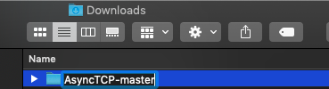
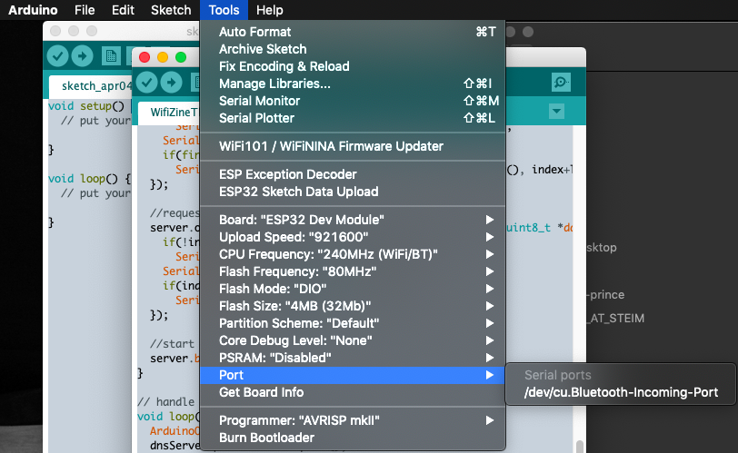
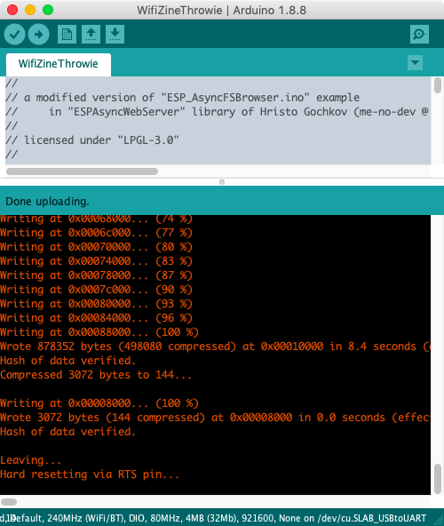
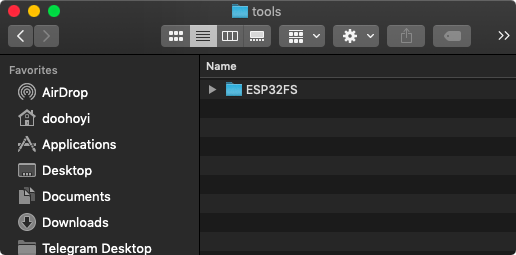
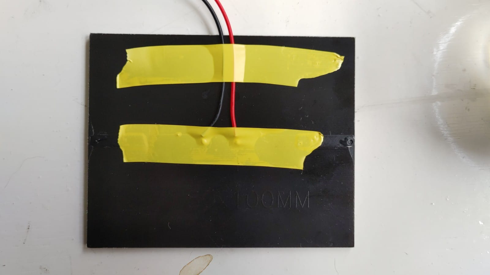
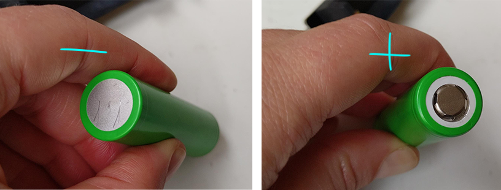

# Prototypes for a lighter internet - TUMO

*Note: the technical instructions in this document are biased towards MacOS operating systems, but we've included instructions for windows and linux as much as possible. Contributions specific to these operating systems are very welcome!*

## About this document

This document describes how to program small wireless device with an ESP32 chip to serve a tiny (<2MB) html websites via WiFi. The module is powered by a battery, which in turn is charged by a solar cell. The Wifi module "serves" a small website anytime a smartphone tries to log on to the network it is broadcasting (like an internet hotspot). It allows you to redesign the "log-in" screen that usually pops up when you try to log on to public WiFi networks, and hijack it to publish content you want to share WiFi, but only with your neighbours and local friends within a ~25 m range. 


### Support

This project was kindly funded by [Fonds voor Cultuurparticipatie](https://cultuurparticipatie.nl/). 


### Workshop background

This is an adaptation of the workshop and – amazing – documentation prepared by Wonjung Shin and Dooho Yi (Dianaband) for the Walking signal / WIFI hotspot zine workshop hosted at Hackers and Designers in 2019. See original here: [https://github.com/applecargo/WifiZineThrowie](https://github.com/applecargo/WifiZineThrowie) 

Their workshop in turn builds up on the research by Andy Reischle (AreResearch), whose research is linked to at the bottom of this page. See also [previous research this project builds upon](https://github.com/hackersanddesigners/WifiZineThrowie_ScavengerHunt#previous-research-this-project-builds-upon).

## Materials

*Account for one kit per duo. Total cost of the components per kit is around € 25,00 ex shipping.*

- A computer per duo
- A mobile phone per duo (no dataplan needed)
- Internet connection to download libraries and look things up
- A development board with ESP32 module and 4MB flash memory, e.g. [ESP32 - CP2102](https://www.tinytronics.nl/shop/nl/development-boards/microcontroller-boards/met-wi-fi/esp32-wifi-en-bluetooth-board-cp2102)
- A short micro USB cable e.g. [this one](https://www.tinytronics.nl/shop/nl/kabels-en-connectoren/kabels-en-adapters/usb/micro-usb/micro-usb-kabel-30cm)
- A 5V charging board e.g. this [LilyGo TTGO H435 with a 18650 rechargeable battery holder](https://www.tinytronics.nl/shop/nl/power/bms-en-laders/li-ion-en-li-po/met-protectiecircuit/lilygo-ttgo-t-bat-met-18650-batterijhouder-cn3065)
- A rechargeable Li-ion battery compatible with the board, e.g. [LG 18650 Li-ion battery 3400mAh](https://www.tinytronics.nl/shop/nl/power/batterijen/18650/lg-18650-li-ion-batterij-3400mah-10a-inr18650-mj1)
- A 5.5V solar cell with JST-PH connector e.g. [Seeed Studio 5.5V Solar Panel](https://www.tinytronics.nl/shop/nl/power/zonne-energie/zonnepanelen/seeed-studio-zonnepaneel-5.5v-170ma-80x100mm-met-jst-ph-connector)
- Web page (html / css / js + media files) (provided when you download the .zip from the github explained in the steps below). 


## Installing the toolchain


First we need to download some tools (more to follow along the way!)

- [**Arduino Download**](https://www.arduino.cc/en/Main/Software)
  - _Please note:_ Download a version **earlier than 2.0.0**, as at the time of writing (February 2023), the plugin we use for SPIFFS image creation and upload is not compatible with 2.0.0+
 
 
- **Installing Arduino**

  - [Windows](https://www.arduino.cc/en/Guide/Windows)

  - [Mac OSX](https://www.arduino.cc/en/Guide/MacOSX)

    [](./images/arduino-confirm.png)

    *Click 'Open'.*

  - [Linux](https://www.arduino.cc/en/Guide/Linux)

- **Arduino IDE settings**

  - Change the compilation and upload process display mode to 'verbose mode'
 	   
 	 


  - Check 'compile' and 'upload' in 'Show verbose output during:'

- [**Adding ESP32 boards to the Arduino IDE's board list**](https://github.com/espressif/arduino-esp32/blob/master/docs/arduino-ide/boards_manager.md)

  - Copy and paste the following into 'Additional Boards Manager URLs' and click 'Ok'.

	[](./images/arduino-board-url.png)

 	 ```
 	 https://dl.espressif.com/dl/package_esp32_index.json
	 ```

- **Launch the Board Manager**

 	  Tools > Board xxxx > Boards Manager " width="550"/>

- **Select the Board Manager pop-up window**
   	 
    

- **Type 'esp32' in the search box and click 'Install'**

    


## Download the example files

[https://bit.ly/hardware_drive](https://bit.ly/hardware_drive)

## Installing the ESPAsyncWebServer library

Next, we need some libraries. 

   - Click 'Clone or download' -> 'Download ZIP' on the github page for the [ESPAsyncWebServer](https://github.com/me-no-dev/ESPAsyncWebServer).

  	 

   - Rename folder after decompression (remove the part "-master")
	   - [](./images/arduino-00003.png)
	   - [](./images/arduino-00004.png)<br>*Screenshots showing folder name, one with -master at the and and one with that part removed.*


## Installing the AsyncTCP library

  - Click 'Clone or download' -> 'Download ZIP' on the github page for the [AsyncTCP library](https://github.com/me-no-dev/AsyncTCP).

    [](./images/arduino-00006.png)<br>*Screenshot showing github repository of the AsyncTCP library*

    - Rename folder after decompression (remove the part "-master")

    	[](./images/arduino-00007.png)
    	[](./images/arduino-00008.png)<br>*Screenshots showing folder name, one with -master at the and and one with that part removed.*

### Move libraries into Arduino folder

Copy these 2 renamed folders to ~/Documents/Arduino/libraries. It should look like this:


- Restart the Arduino IDE (the Arduino software)
- Open **WifiZineThrowie.ino** sketch you downloaded from the google drive
- Select the ESP32 Dev Module board under > Tools > Board
   
 Tools > Board > ESP32 Dev Module" width="450"/>


## Adjust ESP32 Dev Module board settings

- Look up the board settings under > Tools > Most of these settings are correct by default, you just have to change QIO to DIO

      * Board: ESP32 Dev module
      * Upload Speed : 921600
      * CPU Frequency : 240MHz (WiFi BT)
      * Flash Frequency : 80MHz
      * Flash Mode : QIO
      * Flash Size : 4MB (32Mb)
      * Partition Scheme : Default 4 MB with spiffs (1.2MB app, 1.5MB spiffs)
      * Core Debug Level : None
      * PSRAM : Disabled

    Tools in Arduino window" width="350"/>

  
## Test if code will compile

* **Click on the compile button in the top left of the editor (see red arrow in pic beneath)**
      	
     

* **If the compilation process is successful, it will say "DONE COMPILING" at the bottom**
    
	* This means Arduino confirms it can find everything it needs to upload working code 
  
	* Don't upload the code to the board yet, first we need some more stuff
	  	
[](./images/arduino-00009.png)<br>*Screenshot of Arduino window with "done compiling" message in the bottom bar of the window*

	  
* **If the compilation process ends abnormally, it will give an orange error**

* If necessary, troubleshoot using the error messages (if you don't get any, check that "verbose" is checked in settings of Arduino. 
* **for Mac**: you might see an error concerning a missing path for python with the error error *exec: "python": executable file not found in \$PATH*. If this is the case, you check which python you have installed: ```python -version```. If you have python3, it cannot find the right version because version 2 is referred to as "python" and v3 is referred to as "python3". To fix this, you have to replace the reference by entering the following command into terminal and press enter:


```
sed -i -e 's/=python /=python3 /g' ~/Library/Arduino15/packages/esp32/hardware/esp32/*/platform.txt
```

* **For debian linux**: an error we experienced the compilation was missing the python3 library pyserial. This can be fixed by installing the package globally. To do so, open a Terminal window, and execute this command.

```
sudo apt install python3-serial
```


    	  
## Installing a USB device driver to communicate with the ESP32 module (chip name: SiliconLabs CP2012)

Now that we have all the libraries and code ready to be compiled for the ESP, we need to make sure our computer can "speak" to the board. For this, we need a driver. 

### Mac OS

**First, check if you already have this driver installed** by searching your machine for a file named "SiLabsUSBDriver.kext" AND/OR "SiLabsUSBDriverYos.kext" AND/OR "SiLabsUSBDriver64.kext". On a Mac, they can be in either of these folders listed below, depending on your system. If you find nothing, proceed to install. Otherwise, uninstall using the uninstaller provided, before re-installing (drag the uninstall.sh file into a terminal window and hit enter to uninstall.

* /Library/Extensions/SiLabsUSBDriver.kext
* /Library/Extensions/SiLabsUSBDriverYos.kext
* /System/Library/Extensions/SiLabsUSBDriver64.kext
* /System/Library/Extensions/SiLabsUSBDriver.kext
  
  - Download the driver: [Silabs USB communication chip driver download](https://www.silabs.com/products/development-tools/software/usb-to-uart-bridge-vcp-drivers)
  - Doubleclick "Install CP210x VCP Driver.app" to install it. 
  - When it gives a security message, follow the instructions to allow the install to continue


### Linux 3.x.x & 4.x.x

Driver installation not required (included in kernel)
- You should be able to just upload a sketch through the port `/dev/ttyUSB0`
  - it is possible that you need to change the permissions on this port by:
  ```sh
  sudo chmod a+rw /dev/ttyUSB0
  ```
- [udev rules update required](https://docs.platformio.org/en/latest/faq.html#platformio-udev-rules)
- [99-platformio-udev.rules](https://raw.githubusercontent.com/platformio/platformio-core/develop/scripts/99-platformio-udev.rules)

### Linux 2.6.x
[Linux 2.6.x](https://www.silabs.com/documents/login/software/Linux_2.6.x_VCP_Driver_Source.zip)
		- No information

### Windows

- [Windows 10](https://www.silabs.com/documents/public/software/CP210x_Universal_Windows_Driver.zip)
- [Windows 7/8/8.1](https://www.silabs.com/documents/public/software/CP210x_Windows_Drivers.zip)
- [Installation process](https://www.pololu.com/docs/0J7/all)


## Check if the USB driver is working

  - **If you just installed the driver, restart your computer.**

  - For Mac OS users: after restarting, make sure GateKeeper does not interfere with driver loading.

    - System Preferences -> Security & Privacy -> General
      
		
      
		

	- If there is an error message in the red box area, GateKeeper is interrupting the driver's operation. If this is the case, click 'Allow' and confirm with administrator password, **then restart your computer**.

	
	
	
- If the problem persists, troubleshoot using the following instructions as per your operating system

### Bypassing gatekeeper on Mac OS

- [Mac OSX](https://www.silabs.com/documents/public/software/Mac_OSX_VCP_Driver.zip)
	- You need to work around a safety measure called gatekeeper which is a little different per OS operating system. Follow instructions below for your OS or google "disable gatekeeper on mac [insert your version here, e.g. monterey]" [More info here](https://support.apple.com/en-us/HT202491)

	- Mojave (10.14.x)

		- [How to disable GateKeeper](http://osxdaily.com/2016/09/27/allow-apps-from-anywhere-macos-gatekeeper/)

			```
			sudo spctl --master-disable
			```

	- High Sierra (10.13.x)

        - [How to disable GateKeeper](https://stackoverflow.com/questions/47109036/cp2102-device-is-not-listed-in-dev-on-macos-10-13)
        - [How to disable GateKeeper](https://pikeralpha.wordpress.com/2017/08/29/user-approved-kernel-extension-loading/)
        - [How to disable GateKeeper](https://www.silabs.com/community/interface/knowledge-base.entry.html/2018/03/30/usb_to_uart_bridgev-Dnef)
        - https://stackoverflow.com/questions/47109036/cp2102-device-is-not-listed-in-dev-on-macos-10-13 
        - The allow button in the settings menu might not werk, then to disable checking altogether:
			1.	Shut down your Mac
			2.	Start again while holding mac+ R during boot to enter recovery mode
			3.	Open a terminal window
			4.	type the following command and press enter

			```
			spctl kext-consent disable
			```			

			5.	Reboot
			6.	Try install driver again
	

	- Sierra (10.12.x)
        - [How to disable GateKeeper](https://www.tekrevue.com/tip/gatekeeper-macos-sierra/)

				sudo spctl --master-disable

	- El capitan (10.11.x)
		- [How to disable GateKeeper](https://medium.com/@krukmat/macos-el-capitan-enabling-usb-for-cp2102-usb-to-ttl-3b63449e02e9)
        - [csrutil enable --without kext](https://forums.developer.apple.com/thread/17452)

	- Yosemite (10.10.x)
		- [Legacy driver must be installed, instead normal one.](https://www.silabs.com/community/interface/forum.topic.html/latest_vcp_driverfo-96RK)

		
        
		


### **After starting the Arduino IDE, make sure it can communicate with the ESP32 module**

- Plug the ESP board to a USB port of your computer with the USB cable

- If communication is possible, you can select /dev/cu.SLAB_USBtoUART under > Tools > Port (for other than Mac OSX, this name might be different) as shown in the picture below.
    
  

- If communication is not possible, SLAB_USBtoUART  will not show up (for other than Mac OSX, this name might be different.)




### Upload to the Board

  - Click on the Upload button (arrow pointing right on top of the Arduino window), and then **_while_** the text '*Connecting ...*' displays in the control window at the bottom of the screen, [press and hold the' BOOT 'button on the ESP board for one second](https://randomnerdtutorials.com/solved-failed-to-connect-to-esp32-timed-out-waiting-for-packet-header/).
        
     
      
- **If the upload was successful, you will see this screen**: 
	  
	


- **If the upload was unsuccessful, you will see this error**

	[](./images/arduino-wifizine-upload-failed.png)

- [Troubleshooting tips for various problem factors here](https://randomnerdtutorials.com/esp32-troubleshooting-guide/)

- **Mac OS Monterey issue during upload**

	- If you're using Mac OS Monterey, you might get an error like this in the Arduino output window: 

		" *exec: "python": executable file not found in $PATH error on mac monterey* "

	- If that happens, open a Terminal window, and paste the code below to install the right version of Python in the right place. Then hit enter.

		```
		sed -i -e 's/=python /=python3 /g' ~/Library/Arduino15/packages/esp32/hardware/esp32/*/platform.txt
		
		```

	- Now restart the Arduino application and try uploading the code to the board again.

## Publishing your first mini webpage to the module

- The content of the small webpage we will put on the wifi modules is stored separately from the running code that takes care of publishing it. Therefore, it goes through a separate process from the usual Arduino IDE code upload process. To do this, you need to install a separate extension plug-in.

- **Download and install** [**the ESP32FS plug-in**](https://github.com/me-no-dev/arduino-esp32fs-plugin/releases)

- **Create a folder called 'tools' inside ~/Documents/Arduino/**

  [](./images/arduino-esp32fs-00002.png)

  Copy unpacked ESP32FS into the subfolder tools

  [](./images/arduino-esp32fs-00003.png)

  Be mindful with the construction of the folders. It should be installed as shown in the following figure. (Note also that the folder name is ESP32FS!)

  [](./images/arduino-esp32fs-00004.png)

  **After restarting the Arduino IDE**, verify that the plug-in installation was successful. If successful, you will see a menu called 'ESP32 Sketch Data Upload' added.

  [](./images/arduino-esp32fs-00005.png)

 **When you click this menu option, it will move all the files in the '~/Documents/Arduino/WifiZineThrowie/data' folder to the ESP32 module's web page store.**
  
### Changing the name of your wifi network

The arduino code (WifiZineThrowie.ino) specifies the name of your personal mini network by looking for a file in the data folder that ends with .ssid. For example, in the screenshot below you can see it is now called: "solarpunk-schat.ssid". You can change this filename to the name you like for your network (avoid symbols to be sure).  E.g. "find-me". This name should not have special characters and can't be superlong (not sure how long). 


### Uploading your website to the module

Then, in the Arduino software, go to **> Tools > ESP32 Sketch Data Upload** 

  [](./images/arduino-wifizine-webpage-upload.png)

Click to execute the upload. The color of the message output during upload is displayed in white instead of red.  

While 'Connecting ...' displays, [press and hold the' BOOT 'button on the ESP board for one second](https://randomnerdtutorials.com/solved-failed-to-connect-to-esp32-timed-out-waiting-for-packet-header/).

Screen when upload is completed successfully

[](./images/arduino-wifizine-webpage-upload-done.png)

Success! You can now find your private internet spot. Open the network settings on your phone, and select your network. Your website should pop up automatically, but some patience helps :)
  
####  Note for Debian/Ubuntu Linux users
  
  We ran into the issue that uploading would print the error message "**SPIFFS Upload failed!**" without further explanation. [Thankfully, this person ran into the same issue and fixed it by opening a terminal and running these commands](https://github.com/me-no-dev/arduino-esp32fs-plugin/issues/41):
 ```sh
sudo apt update
sudo apt install python-is-python3
```
  
  
### Find your wifi network!

Look up the list of available networks on your phone with the name you provided to the .ssid file earlier. You should see your network popping up there. Try connecting to it. Your website should come up automatically with a pop-up window. 


### OPTIONAL - Increasing the upload capacity of the board (at your own risk)

It is possible to increase the upload capacity of the board so you can make slightly bigger websites. This is documented by Doohoyi from Dianaband, but we haven't tried it. Proceed at your own risk!

[Dianaband's workshop documentation](https://github.com/applecargo/WifiZineThrowie/blob/master/docs/index.md#increasing-the-upload-capacity-of-the-board-optional)


## Power up your module!

### Step 1: Prepare the solar panel

Enforce the connections with some electrical tape (or normal tape if you don't have any, or hotglue even). 



### Step 2: Insert the battery into the charging board

The flatter side is -, the less flat side is +

If you are not sure, check with a multimeter. 

A green light will turn on to indicate it is powered up. 




### Step 3: Plug in the USB cable and power the board

Connect the solar panel to the board as indicated in the image. Plug the Wifi module to the USB port. 

If the battery is fully powered, a second light will turn on to indicate charging is done (marked CHG DONE on the PCB board). 


## Previous research this project builds upon

Dianaband's workshop, and this H&D workshop builds upon the generous documentation of Andy Reischle on his blog AReResearch. Check it out! He is very funny too :) 

- [CaptiveIntraweb by AReResearch (Andy Reischle) @ 2015](https://github.com/reischle/CaptiveIntraweb)

<br>*Diagram of the protocol we are using with our set-up, made by Andy Reischle*

## Technical details 

Below is a diagram and list of technologies ("stack") that makes up this application. This information was compiled by Dianaband for the original workshop. 

- Intangible components
  - [ESP-IDF Development Environment](https://github.com/espressif/esp-idf/tree/master/components)
  - [ESP32 Arduino Compatibility Package](https://github.com/espressif/arduino-esp32)
  - [SPIFFS file system](https://github.com/espressif/arduino-esp32/tree/master/libraries/SPIFFS)
  - [ESP web server library](https://github.com/me-no-dev/ESPAsyncWebServer)
  - [A domain name server (captive portal)](https://github.com/espressif/arduino-esp32/tree/master/libraries/DNSServer)
  - Webpage (the one you wrote in HTML)

<br>*Diagram of the technology stack used in the project*

  - [More information](http://esp32.net/)
  - [The Wi-Fi stack is not open source](https://github.com/espressif/esp32-wifi-lib/issues/2)


